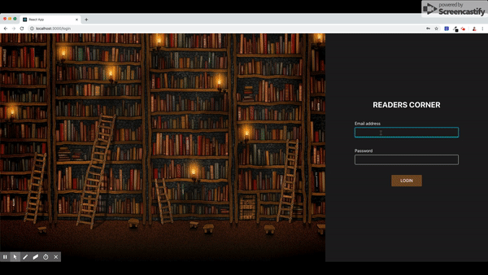

# React-JS-Starter-Kit
A React JS application which includes redux, authentication, routes handling with authentication, API call.

Application handles authentication in routes, a logged in user will not be able to navigate to login screen unless he is logged out. And if a user is not logged in will not be able to enter into the other screens other than login. URL also restricts the same authentication.

# Login Credentials
  Email: eve.holt@reqres.in
  Password: cityslicka
  
## Working
  ### Web view
  
  
  ### Mobile view
  
